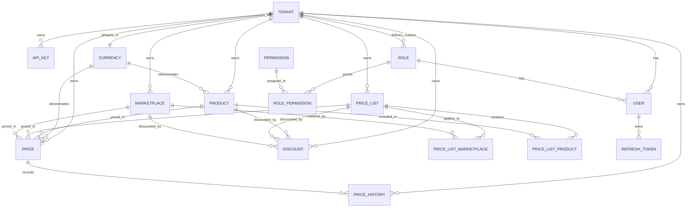

# PriceGrid — Price Management Admin Application

## Implementation Plan (Phase 1: Architecture, Database, Auth, Multi-tenant, Core CRUD, Seeds & Unit Testing)

> **Working title:** PriceGrid (placeholder; rename freely if a final brand is chosen later).
> **Scope of this phase:** initial architecture, database design, authentication (JWT + API keys), multi-tenant isolation, core CRUD operations, price/discount calculation (non-stacking), price history, audit, currencies (read-only), external read-only API, **obligatory seeds** and **mandatory unit testing for backend and frontend**. **No real marketplace integration yet** — the structure (API keys + scopes + external endpoints) prepares for it.

---

## 1. Overview

PriceGrid is a multi-tenant administrative web application to **capture, edit and propagate product prices** across multiple marketplaces (Amazon, Mercado Libre, and an owned store). It manages companies (tenants), products, marketplaces, price lists, per-product/list prices, non-stacking discounts with priority rules, currencies, API keys and users, and exposes a clean dashboard to operate them.

### 1.1 Goals of this phase

1. Separate **backend** and **frontend** projects under `src/`.
2. REST API with **JWT authentication + refresh token (HttpOnly Secure cookie)** and **API key authentication with read scopes**.
3. **Multi-tenant** isolation with a single shared database: tenant resolution (`X-Tenant-Id` for global admin) and strict data scoping.
4. MySQL database created via **migrations** and populated via **seeds** (idempotent, base + demo separated, see §7).
5. Initial **global admin user**, **demo company (tenant)**, **tenant admin user**, and initial catalogs (currencies, permissions, roles, marketplaces, price lists, demo products, demo discount).
6. Working CRUD for all core entities (with **soft delete**), plus **audit** and **price history** recorded on changes.
7. **Mandatory unit tests** for backend (≥70%, Jest) and frontend (≥60%, Jasmine + Karma), with coverage reports.
8. A modern, compact, SaaS-style admin dashboard (not a landing page) consuming the real API.
9. Basic documentation to install, configure, run and test.

### 1.2 Non-goals of this phase

- Real Amazon / Mercado Libre API integration (the external API + scopes model prepares for it).
- **Stacking/accumulating multiple discounts** (explicitly deferred; see §5 and §15).
- **Automatic currency conversion / exchange rates** (deferred; see §12 and §15).
- **Currency admin CRUD** (currencies are read-only; see §9 and §15).
- API key **write** scopes (deferred; phase 1 is read-only scopes).
- Billing / subscription logic.
- End-to-end / integration test suites (explicitly deferred; see §11).

---

## 2. Architecture

### 2.1 High-level view

```
┌─────────────────────────────┐         ┌────────────────────────────────────┐
│  Frontend (prices-admin)    │  HTTPS  │   Backend (prices-api)             │
│  Angular + Tailwind         │ ──────► │   Node.js + Express + TypeScript   │
│  spartan/ui + lucide-angular│  JSON   │   JWT auth + API-key auth (X-API-Key)│
│  Reactive Forms / signals   │         │   Tenant resolution + RBAC/scopes  │
│  Angular HttpClient         │         │   Controller→Service→Repository    │
└─────────────────────────────┘         └───────────────┬────────────────────┘
                                                        │ Prisma ORM
                                                        ▼
                                                ┌───────────────┐
                                                │  MySQL (single │
                                                │  shared DB,    │
                                                │  multi-tenant  │
                                                │  migrations    │
                                                │  + seeds)      │
                                                └───────────────┘
```

### 2.2 Tech stack

| Layer       | Technology | Rationale |
|-------------|------------|-----------|
| Backend     | **Node.js + Express + TypeScript** | Fixed requirement |
| DI          | **tsyringe** + `reflect-metadata` | Constructor injection (composition root); maps to SOLID |
| ORM         | **Prisma** | Type-safe schema, migrations (`prisma migrate`) and seeds (`prisma db seed`) |
| Validation  | **Zod** (validators + middleware) | Typed input validation |
| Auth        | `jsonwebtoken`, `argon2`/`bcrypt`, custom API-key middleware | Access + refresh tokens (cookie) + API keys with read scopes |
| Logging     | **pino** + `pino-http` | Structured JSON to stdout/stderr, redaction |
| **Backend tests** | **Jest** | Required unit-test framework, coverage report |
| Frontend    | **Angular 17+** (standalone components, signals) | Matches guards/interceptors/pipes + standard Angular testing |
| Styling     | **Tailwind CSS** + **spartan/ui** (shadcn-style primitives for Angular) + **lucide-angular** | Requirement + consistency |
| Server state | Angular `HttpClient` + RxJS + signals | Caching/loading/error handling |
| Forms       | **Reactive Forms** + Zod cross-validation | Typed, validated forms |
| Routing     | Angular Router (guards/resolvers) | Protected routes |
| Charts      | **ngx-charts** (or ngx-echarts) | Lightweight "simple chart" |
| **Frontend tests** | **Jasmine + Karma** (Angular CLI standard) + `TestBed` | Required unit-test setup, coverage report |
| DB          | **MySQL 8** | Requirement |

### 2.3 Backend layering (SOLID, Express)

```
Routes ──► Controllers ──► Services ──► Repositories ──► PrismaClient ──► MySQL
  │             │               │              │
  │             │               │              └── data access ONLY (no business rules)
  │             │               └── business logic, orchestration, transactions,
  │             │                   tenant scoping, audit, price-history writes
  │             └── HTTP concerns: parse request, validate DTO, status codes, delegate
  └── URL/method → controller wiring (admin API vs external API)
```

Concepts and responsibilities (Express-native only):

- **Routes** define URL/method wiring and mount **middlewares** (auth, tenant, validation) per route group.
- **Controllers** contain no business logic — only request parsing/validation and delegation to services.
- **Services** own business rules (price calculation, discount resolution, invariants, audit, history).
- **Repositories** own persistence and **enforce tenant scoping**; they sit behind **interfaces** so they can be mocked in tests (Dependency Inversion Principle).
- **Middlewares** handle cross-cutting concerns: auth (JWT/API-key), tenant resolution, validation, request-id/tracing, error handling, logging.
- **Validators** (Zod schemas) + a validation middleware enforce input contracts.
- **Centralized error handler** (middleware) maps domain errors to a consistent HTTP envelope.
- **Dependency Injection** via **tsyringe**, wired in a composition root (`src/di/container.ts`).

### 2.4 Multi-tenant & auth model (overview)

- A **company (tenant)** is the top-level isolation boundary: it owns products, lists, marketplaces, prices, discounts, API keys and (non-global) users.
- Every business table carries `tenant_id`; all repository queries filter by the **resolved tenant**.
- **Tenant resolution** (middleware) derives the tenant from:
  1. **JWT claim** `tenantId` (non-global dashboard users), or
  2. **`X-Tenant-Id` header** (global admin only — see §6.3), or
  3. **API key** (`X-API-Key`) → `api_keys` lookup → `tenant_id` + `scopes` (external/integration access).
- A **global admin** (role `global_admin`, `users.tenant_id = null`) manages companies and selects the active tenant via `X-Tenant-Id`.
- **RBAC** governs dashboard users (permissions via roles, global + per-tenant roles). **Scopes** govern API keys (read-only capabilities for phase 1).
- Isolation is enforced in repositories (defense in depth), not only in controllers, and is covered by tests (§11).

---

## 3. Project structure

```
src/
  backend/prices-api/
    prisma/
      schema.prisma
      migrations/
      seed/
        index.ts          # orchestrator (idempotent; base + demo with env gate)
        base/
          currencies.ts
          permissions.ts
          roles.ts
        demo/
          tenants.ts
          users.ts
          marketplaces.ts
          price-lists.ts
          products.ts
          relations.ts
          prices.ts       # + price_history on create
          discounts.ts
        api-key.ts        # optional dev demo key (separate command)
    src/
      server.ts          # bootstrap / listen
      app.ts             # express app assembly (middlewares, routes)
      config/            # env-driven configuration
      di/                # tsyringe container / composition root
      routes/            # admin.routes.ts, auth.routes.ts, external.routes.ts, health.routes.ts
      controllers/       # auth, tenants, api-keys, users, roles, products, ...
      services/          # business logic
      repositories/      # data access (interfaces + Prisma impl)
      middlewares/       # auth (jwt, api-key), tenant, validate, error-handler, request-id, logging
      validators/        # zod schemas (per entity + query params)
      common/
        errors/          # domain error classes
        logger/          # pino setup + redaction
        utils/           # pagination, formatting, guards
      types/             # shared types (Request with user/tenant, enums)
    tests/               # unit tests (Jest), colocated *.spec.ts
    jest.config.ts
    .env.example
    package.json
    tsconfig.json

  frontend/prices-admin/
    src/
      main.ts
      app/
        app.config.ts
        app.routes.ts
        core/
          guards/        # auth.guard, role.guard, tenant.guard
          interceptors/  # jwt.interceptor, error.interceptor
          pipes/         # status, currency, date pipes
          services/      # auth, api, products, ... services
      features/
        auth/            # login
        dashboard/
        companies/       # empresas / tenants (global admin)
        products/
        prices/
        price-history/
        price-lists/
        marketplaces/
        discounts/
        api-keys/
        users/
        roles/
        settings/        # includes currencies (read-only)
      shared/
        ui/              # spartan/ui-based primitives + themed components
        components/      # DataTable, StatusBadge, FilterChips, EmptyState, ...
      styles/
    angular.json
    karma.conf.js
    tailwind.config.ts
    package.json
    tsconfig.json

README.md
IMPLEMENTATION_PLAN.md        # this file
```

---

## 4. Database design

### 4.1 ERD (conceptual)



### 4.2 Identifiers

- **UUID** is the standard for all primary entities (`id` UUID PK), including tenants, users, roles, products, marketplaces, price lists, prices, discounts, api_keys, price_history.
- Rationale: future compatibility with external integrations, synchronization, and distributed/offline data.

### 4.3 Audit fields (convention)

Every primary record includes these columns (applied to all tenant/business tables and catalog tables):

| column | type | notes |
|---|---|---|
| `created_at` | datetime(3) UTC | set on insert |
| `updated_at` | datetime(3) UTC | set on update |
| `deleted_at` | datetime(3) nullable | soft delete when present |
| `created_by` | UUID nullable | actor id (user, api key, or system) |
| `created_by_type` | enum `user\|api_key\|system` | actor discriminator |
| `updated_by` | UUID nullable | actor id |
| `updated_by_type` | enum `user\|api_key\|system` | actor discriminator |

- Services set `created_by` / `updated_by` and the discriminator on every write.
- Dashboard-user operations record the user id; **API-key operations record `api_key`** with the key id; seeds use `system`.

### 4.4 Soft delete policy

**Soft delete** (`deleted_at`) is used for the main entities: **tenants, users, products, marketplaces, price_lists, prices, discounts, api_keys**.

- API `DELETE` endpoints mark `deleted_at` (and set `status` accordingly) rather than removing rows.
- **`price_history` is append-only** and is never physically deleted in normal flows.
- **System catalogs** — `permissions`, base `roles`, and `currencies` — are **not physically deleted** in phase 1.

### 4.5 Tables

> Conventions: `id` UUID PK. Tenant-scoped tables carry `tenant_id` (FK to `tenants`), `status` (`active|inactive` unless noted), audit fields (§4.3), `deleted_at` soft delete where configured (§4.4), and composite indexes/unique constraints that include `tenant_id` (e.g. `sku` unique **per tenant**). Money is `DECIMAL(12,2)`; dates `DATETIME(3)` UTC.

**`currencies`** (global catalog, read-only in phase 1)
| column | type | notes |
|---|---|---|
| id | UUID | PK |
| code | char(3) | ISO 4217, unique (e.g. `MXN`, `USD`) |
| name | varchar | |
| symbol | varchar | e.g. `$` |
| decimals | int | default 2; used for rounding |
| status | active/inactive | |
| audit fields | | |

**`tenants`** (companies)
| column | type | notes |
|---|---|---|
| id | UUID | PK |
| commercial_name | varchar | display name |
| legal_name | varchar | |
| slug | varchar | unique |
| status | active/inactive | |
| default_currency | char(3) FK → currencies.code | |
| notes | text nullable | |
| created_at / updated_at / deleted_at / created_by / updated_by | | audit + soft delete |

**`users`** — `id, tenant_id (FK nullable — null for global admin), name, email (unique, lowercased), password_hash, role_id (FK), status, last_login_at, deleted_at` + audit fields.

**`roles`** (global/system + per-tenant custom)
| column | type | notes |
|---|---|---|
| id | UUID | PK |
| tenant_id | UUID FK nullable | `null` = global/system role; otherwise tenant-owned custom role |
| name | varchar | |
| slug | varchar | system roles: globally unique; tenant roles: unique per `(tenant_id, slug)` |
| description | varchar | |
| is_system | bool | `true` for seeded base roles |
| status | active/inactive | |
| audit fields | | |

> **Role resolution:** a tenant's role list = global/system roles (`tenant_id = null`) **plus** its own custom roles (`tenant_id = <tenant>`). System roles are `is_system = true` and are not physically deleted in phase 1.

**`permissions`** — `id, name, slug (unique), description` + audit fields (system catalog, read-only in phase 1).

**`role_permissions`** — join: `role_id, permission_id` (composite PK).

**`refresh_tokens`** — `id, user_id (FK), token_hash, expires_at, revoked_at, replaced_by_id, created_at, user_agent, ip` (hashed; supports rotation & revocation). The raw token lives in an **HttpOnly Secure cookie**; the server stores only the hash.

**`api_keys`**
| column | type | notes |
|---|---|---|
| id | UUID | PK |
| tenant_id | FK | owner tenant |
| name | varchar | label |
| key_hash | varchar | hashed secret (never store plaintext) |
| prefix | varchar | short prefix for display (e.g. first 8 chars) |
| scopes | json | array of scope slugs, read-only in phase 1 |
| status | enum `active\|revoked` | **persisted** state |
| expires_at | datetime nullable | when `< now` and status = `active` → **derived** state `expired` |
| revoked_at | datetime nullable | set on revoke → status `revoked` |
| last_used_at | datetime nullable | |
| deleted_at | datetime nullable | soft delete |
| created_at / updated_at / created_by / updated_by | | audit |

> **Expired is derived, not persisted** (see §6.2): `revoked` is persisted via `revoked_at`; `expired` is computed when `expires_at < now`. The API returns an effective status (`active|revoked|expired`) for display, avoiding desync between `status` and `expires_at`.

**`products`** — `id, tenant_id, sku, name, description, base_price (DECIMAL), currency_code (char(3) FK), status, deleted_at` + audit. Unique `(tenant_id, sku)`.

**`marketplaces`** — `id, tenant_id, name, code (amazon|mercadolibre|own_store), config (json, null), status, deleted_at` + audit.

**`price_lists`** — `id, tenant_id, name, description, currency_code (char(3) FK nullable — inherits product/tenant default when null), status, deleted_at` + audit.

**`price_list_marketplaces`** — join: `price_list_id, marketplace_id` (a price list applies to one or many marketplaces).

**`price_list_products`** — join: `price_list_id, product_id` (a product belongs to one or many price lists).

**`prices`** (price per product + list + marketplace)
| column | type | notes |
|---|---|---|
| id | UUID | PK |
| tenant_id | FK | isolation |
| product_id | FK | |
| price_list_id | FK | |
| marketplace_id | FK | |
| base_price | DECIMAL(12,2) | |
| currency_code | char(3) FK | |
| final_price | DECIMAL(12,2) | computed by engine; stored for display |
| start_date / end_date | datetime | nullable end = indefinite |
| status | active/inactive | |
| notes | text nullable | |
| deleted_at | datetime nullable | soft delete |
| audit fields | | |
| unique | (tenant_id, product_id, price_list_id, marketplace_id, start_date) | |

**`price_history`** (append-only audit on price change — never physically deleted)
| column | type | notes |
|---|---|---|
| id | UUID | PK |
| tenant_id | FK | isolation |
| price_id | FK | |
| product_id | FK | denormalized for queries |
| old_base_price / new_base_price | DECIMAL | |
| old_final_price / new_final_price | DECIMAL | |
| changed_by_type | enum `user\|api_key\|system` | actor |
| changed_by_id | UUID | actor id |
| reason | varchar | `create`, `update`, `discount_change` |
| created_at | datetime | |

**`discounts`** (product-, list-, or marketplace-scoped, with date validity — **non-stacking in phase 1**)
| column | type | notes |
|---|---|---|
| id | UUID | PK |
| tenant_id | FK | isolation |
| name | varchar | |
| type | `percentage\|fixed` | |
| value | DECIMAL(12,2) | % (0–100) or fixed amount |
| applies_to | `product\|price_list\|marketplace` | scope |
| product_id | FK nullable | set when `applies_to = product` |
| price_list_id | FK nullable | set when `applies_to = price_list` |
| marketplace_id | FK nullable | set when `applies_to = marketplace` |
| start_date / end_date | datetime | validity window |
| priority | int | tie-breaker **within the same scope** (lower = first) |
| status | active/inactive | |
| description | text nullable | |
| deleted_at | datetime nullable | soft delete |
| audit fields | | |

> **Checks:** exactly one scope FK must be set matching `applies_to`; `value ≥ 0`; percentage `≤ 100`; `end_date > start_date` when end set.

---

## 5. Pricing & discount engine (business rules — phase 1, non-stacking)

A dedicated, **pure** `PricingService` computes the **final price**. In **phase 1, exactly ONE discount is applied** — discounts never stack or accumulate.

**Deterministic single-discount precedence (highest → lowest):**

1. **Product**-scoped discount (if a valid one exists)
2. Else, **price list**-scoped discount
3. Else, **marketplace**-scoped discount
4. Else, **base price** (no discount applied)

**Resolution algorithm:**
1. For a price `(product_id, price_list_id, marketplace_id)`, find active discounts (status `active`, `start_date ≤ now ≤ end_date`).
2. Check in fixed scope order:
   - Product discounts → pick **one**; if multiple, order by `priority ASC`, then `created_at ASC`.
   - Else price-list discounts → pick **one** (same tie-break).
   - Else marketplace discounts → pick **one** (same tie-break).
   - Else: no discount → `final = base_price`.
3. Apply the **single** selected discount:
```
fixed:      final = base_price - value
percentage: final = base_price * (1 - value / 100)
final = max(final, floor)      # floor = configurable, default 0
final = round(final, currency_decimals)   # decimals from the price's currency
```
4. The result is written to `prices.final_price` on create/update.
5. **Price history:** any change to a price's `base_price` or `final_price` inserts a `price_history` row **in the same transaction** (service layer), recording old/new values and the actor (`user` or `api_key`).

**Explicitly deferred to a future phase (NOT in phase 1):** `stackable`/exclusive flags, summing multiple fixed discounts, chaining multiple percentage discounts, and any multi-discount combination logic.

This engine is **pure and unit-tested** independently of HTTP/DB (§11). Scope precedence and `priority`/`created_at` tie-breakers are explicit test cases.

---

## 6. Authentication & authorization

### 6.1 Dashboard users (JWT + refresh + RBAC)
- **Login** → short-lived **access token** (JWT, ~15 min, claims: `sub`, `tenantId` (null for global admin), `role`) returned in the response body and **kept in frontend memory**, plus a **refresh token stored in an `HttpOnly Secure` cookie** (hashed in DB via `refresh_tokens`).
- **Refresh** → verifies the cookie + hashed refresh token, **rotates** it (new cookie + new DB row; old token revoked/replaced). Reuse of a revoked token invalidates the family (reuse detection).
- **Logout** → clears the cookie and revokes the refresh token.
- **Me** → authenticated user + role + permissions + tenant.
- Passwords hashed with **argon2id** (bcrypt acceptable).
- **RBAC:** permission-checking middleware verifies permissions via role assignments (e.g. `products:create`).

**Refresh token storage implications:**
- Refresh token: **`HttpOnly Secure` cookie** — never in `localStorage`.
- Access token: **frontend memory** only.
- Configure **CORS with credentials** (`credentials: true` + explicit origin).
- `SameSite=Lax` for local/dev (or as configured); `Secure=true` **in production** (requires HTTPS).

### 6.2 API keys (external access + read scopes)
- `apiKeyAuth` middleware reads `X-API-Key`, looks up the hashed key, and resolves `tenant_id` + `scopes`; updates `last_used_at`.
- **Effective status:** `revoked` is persisted (`revoked_at` + `status = revoked`); `expired` is **derived** when `expires_at < now`. A key is rejected if revoked **or** expired. The API may return `expired` as a derived state for display — it is **never written** into `status` (no desync between `status` and `expires_at`).
- `requireScope('products:read')` middleware validates the resolved scopes.
- **Phase 1 scopes (read-only):** `products:read`, `prices:read`, `price-lists:read`, `marketplaces:read`. **Write scopes are a future phase.**

### 6.3 Companies (tenants) & global admin
- A **global admin** (role `global_admin`, `users.tenant_id = null`) manages companies and selects the active tenant via the **`X-Tenant-Id`** header.
- **Only** users with the `global_admin` role may use `X-Tenant-Id`.
- Non-global users take their tenant **exclusively from the JWT**; if a non-global user sends `X-Tenant-Id`, it is **rejected** with an authorization error (or ignored — rejected is the stricter, recommended default).
- Non-global users are bound to a single `tenant_id`; the company selector in the UI is hidden for them.

### 6.4 Tenant resolution & isolation
Resolution order (middleware):
1. **API key** (`X-API-Key`) → tenant from the key (external API).
2. **Global admin** → tenant from `X-Tenant-Id` (admin API).
3. **Non-global user** → tenant from JWT claim (admin API); `X-Tenant-Id` rejected if present.
- Missing/invalid/ambiguous tenant → `401`/`400` as appropriate.
- Repositories **always** filter by `tenant_id`; cross-tenant IDs return `404` (not `403`, to avoid leaking existence).
- Covered by tests: resolution from each auth method, `X-Tenant-Id` allowed only for global admin, cross-tenant read/write denial, API-key-scope isolation, global-admin cross-tenant switching.

### 6.5 Seed data (initial)
Seed data is defined in detail in **§7 — Initial Data & Seeds**. In summary: **base seeds** create currencies (MXN, USD), the full permission catalog and system roles; **demo seeds** (gated by env) create the demo company, demo users, marketplaces, price lists, products, relations, prices (+history) and a demo discount. An **optional development API key** is generated via a separate command.

---

## 7. Initial Data & Seeds

**Principle:** migrations create/modify **schema**; seeds insert **initial/default data**. Business data is **never** placed inside migrations unless strictly required by a technical constraint. Seeds must be **idempotent** and re-runnable.

### 7.1 Seed entrypoint & commands

```bash
# 1) Structure (create/modify schema only)
npx prisma migrate dev        # dev: creates + applies + generates client
npx prisma migrate deploy     # apply pending migrations (CI/staging/prod)

# 2) Initial data (idempotent; base always, demo only when allowed)
npm run seed                  # → prisma db seed (configured in package.json)
#   "prisma": { "seed": "ts-node prisma/seed/index.ts" }

# 3) Optional: generate a DEVELOPMENT demo API key (prints the plaintext key ONCE to console)
npm run seed:demo-api-key
```

The orchestrator (`prisma/seed/index.ts`) runs base seeds first, then demo seeds (only when allowed), in dependency order: currencies → permissions → roles → tenants → users → marketplaces → price lists → products → relations → prices (+history) → discounts.

### 7.2 Base vs demo seeds (environment protection)

| Group | Contents | When |
|---|---|---|
| **base seeds** | currencies, permissions, system roles | **always** |
| **demo seeds** | demo company, demo users, marketplaces, price lists, products, relations, prices (+history), discount | only in dev/local |

- **Local/development:** `npm run seed` runs **base + demo**.
- **Production/staging:** demo seeds must **not** run by accident. Gate with `ALLOW_DEMO_SEED=true` (or `NODE_ENV=development`); when disabled, only base seeds run.
- This protection is documented in the README.

### 7.3 Currencies (base seed, read-only)

Insert at least (upsert by unique `code`):

| code | name | symbol | decimals | status |
|---|---|---|---|---|
| `MXN` | Peso mexicano | `$` | 2 | active |
| `USD` | Dólar estadounidense | `$` | 2 | active |

### 7.4 Permissions (base seed)

Insert the base permission catalog (upsert by unique `slug`), using the `module:action` pattern. **Modules:** tenants, users, roles, permissions, products, marketplaces, price-lists, prices, discounts, price-history, api-keys, currencies, dashboard, settings.

| Module | Permissions (slugs) |
|---|---|
| tenants | `tenants:read`, `tenants:create`, `tenants:update`, `tenants:delete`, `tenants:switch` |
| users | `users:read`, `users:create`, `users:update`, `users:delete` |
| roles | `roles:read`, `roles:create`, `roles:update`, `roles:delete`, `roles:assign-permissions` |
| permissions | `permissions:read` |
| products | `products:read`, `products:create`, `products:update`, `products:delete` |
| marketplaces | `marketplaces:read`, `marketplaces:create`, `marketplaces:update`, `marketplaces:delete` |
| price-lists | `price-lists:read`, `price-lists:create`, `price-lists:update`, `price-lists:delete` |
| prices | `prices:read`, `prices:create`, `prices:update`, `prices:delete`, `prices:calculate` |
| discounts | `discounts:read`, `discounts:create`, `discounts:update`, `discounts:delete` |
| price-history | `price-history:read` |
| api-keys | `api-keys:read`, `api-keys:create`, `api-keys:update`, `api-keys:delete`, `api-keys:revoke` |
| currencies | `currencies:read` |
| dashboard | `dashboard:read` |
| settings | `settings:read`, `settings:update` |

> Special actions: `revoke` (API keys), `assign-permissions` (roles), `calculate` (prices), `switch` (global admin tenant switching — the "switch-tenant" capability).

### 7.5 Roles (base seed, global/system)

Insert base system roles with **`tenant_id = null`** and **`is_system = true`** (upsert by unique `slug`):

| Role | Permissions |
|---|---|
| `global_admin` | **All** permissions, including `tenants:switch`, `tenants:create/update/delete`, `users:*, roles:*, api-keys:*` |
| `tenant_admin` | All permissions **within its tenant**, **except** global tenant management (`tenants:create`, `tenants:update`, `tenants:delete`, `tenants:switch`). Keeps `tenants:read` (own company). |
| `tenant_user` | Operational read/write on main modules: `products:read/create/update`, `price-lists:read/create/update`, `prices:read/create/update/calculate`, `discounts:read/create/update`, `marketplaces:read`, `price-history:read`, `currencies:read`, `dashboard:read` |
| `readonly_user` | Read-only: `products:read`, `marketplaces:read`, `price-lists:read`, `prices:read`, `discounts:read`, `price-history:read`, `currencies:read`, `dashboard:read` |

> Custom roles may be created per tenant with `tenant_id = <tenant>`. Role queries for a tenant return system roles (`tenant_id = null`) **plus** the tenant's own roles.

### 7.6 Demo company / tenant (demo seed)

Upsert by unique `slug`:

| field | value |
|---|---|
| commercial_name | `Demo Company` |
| legal_name | `Demo Company S.A. de C.V.` |
| slug | `demo-company` |
| status | `active` |
| default_currency | `MXN` |
| notes | `Empresa inicial para desarrollo y pruebas` |

### 7.7 Initial users (demo seed)

Passwords are hashed with **argon2id** (bcrypt acceptable). Upsert by unique `email`.

| User | email (env) | password (env) | role | tenant_id |
|---|---|---|---|---|
| Global admin | `SEED_GLOBAL_ADMIN_EMAIL` | `SEED_GLOBAL_ADMIN_PASSWORD` | `global_admin` | `null` |
| Demo tenant admin | `SEED_TENANT_ADMIN_EMAIL` | `SEED_TENANT_ADMIN_PASSWORD` | `tenant_admin` | Demo Company |

> Env fallback defaults are provided in `.env.example` for local development only; change them in non-local environments (see §7.15).

### 7.8 Marketplaces (demo seed — demo company)

Upsert by unique `(tenant_id, code)`:

| name | code | status | tenant_id |
|---|---|---|---|
| Amazon | `amazon` | active | Demo Company |
| Mercado Libre | `mercadolibre` | active | Demo Company |
| Tienda propia | `own_store` | active | Demo Company |

### 7.9 Price lists (demo seed — demo company)

Upsert by unique `(tenant_id, name)`:

| name | description | currency_code | status |
|---|---|---|---|
| Retail | `Lista de precios minorista` | MXN | active |
| Wholesale | `Lista de precios mayorista` | MXN | active |
| Marketplace | `Lista de precios para marketplaces` | MXN | active |

### 7.10 Demo products (demo seed)

Upsert by unique `(tenant_id, sku)`; all `currency_code = MXN`, `status = active`.

| sku | name | description | base_price |
|---|---|---|---|
| `SKU-DEMO-001` | Producto Demo 1 | `Producto de ejemplo para desarrollo` | 100.00 |
| `SKU-DEMO-002` | Producto Demo 2 | `Producto de ejemplo para desarrollo` | 250.00 |
| `SKU-DEMO-003` | Producto Demo 3 | `Producto de ejemplo para desarrollo` | 500.00 |

### 7.11 Relations (demo seed)

- Associate demo products with price lists (`price_list_products`).
- Associate price lists with marketplaces (`price_list_marketplaces`).
- Create initial **prices** per product × list × marketplace (using §5 engine to set `final_price`).

### 7.12 Demo discount (demo seed)

Upsert by unique key (e.g. `(tenant_id, name)`):

| field | value |
|---|---|
| name | `Descuento demo 10%` |
| type | `percentage` |
| value | `10` |
| applies_to | `product` **or** `price_list` |
| related entity | a demo product or price list |
| start_date | now (valid) |
| end_date | optional / future |
| status | `active` |

### 7.13 Initial price history (demo seed)

When seeds create initial prices, they also insert `price_history` rows with:

- `reason = create`
- `changed_by_type = system`
- `changed_by_id = null`

### 7.14 Demo API key (separate command — closed decision)

- `npm run seed` inserts base + demo data **without** generating any API key.
- `npm run seed:demo-api-key` generates a development API key **on demand** (separate command).
- Only the **hash** is stored in the DB; the plaintext key is printed **once** to the console.
- The generated key is scoped read-only (`products:read`, `prices:read`, `price-lists:read`, `marketplaces:read`) and bound to the demo company.
- **Never hardcode real API keys** in versioned files.

### 7.15 Idempotency

- All seeds use **upserts** keyed by unique fields (e.g. `currencies.code`, `permissions.slug`, `roles.slug`, `tenants.slug`, `users.email`, `marketplaces (tenant_id, code)`, `price_lists (tenant_id, name)`, `products (tenant_id, sku)`, `discounts (tenant_id, name)`).
- Re-running the seed must not duplicate records or corrupt existing data.
- Relations and prices must also be idempotent (skip if already present).

### 7.16 Documentation (README)

The README must document:
- How to run **migrations** (`prisma migrate dev` / `prisma migrate deploy`).
- How to run **seeds** (`npm run seed`, `npm run seed:demo-api-key`).
- **Base vs demo seeds** and the `ALLOW_DEMO_SEED` / `NODE_ENV` protection.
- **What initial data** is created (currencies, permissions, roles, demo company, users, marketplaces, price lists, products, relations, prices, discount, history, optional API key).
- Which `.env` variables configure the initial users (`SEED_GLOBAL_ADMIN_EMAIL/PASSWORD`, `SEED_TENANT_ADMIN_EMAIL/PASSWORD`) and demo seeds (`ALLOW_DEMO_SEED`).
- **Initial development credentials** (from `.env.example` defaults).
- **Warning:** change credentials outside local environments.

### 7.17 Acceptance criteria (seeds)

- After migrations + seeds, **login works with the global admin**.
- After migrations + seeds, a **functional demo company** exists.
- After migrations + seeds, a **tenant admin user** exists.
- The **dashboard shows demo data**.
- **External endpoints can be tested** with demo data once a development API key is generated.
- **Seeds can run multiple times** without duplicating data.
- **Demo seeds do not run** unless explicitly allowed (`ALLOW_DEMO_SEED=true` / `NODE_ENV=development`).

---

## 8. REST API specification

Base path `/api/v1`. All list endpoints support `?page=1&limit=20&search=&status=&sort=&order=` and are **tenant-scoped**. Pagination returns `{ data, meta: { page, limit, total, totalPages } }`.

> **Tenant context header:** administrative requests from a **global admin** may carry `X-Tenant-Id` to select the active tenant; non-global users' tenant comes from the JWT only (§6.3).

### Auth
| Method | Path | Description |
|---|---|---|
| POST | `/auth/login` | email + password → `{ accessToken, user }` + refresh token cookie |
| POST | `/auth/refresh` | refresh token (cookie) → new access token + rotated refresh cookie |
| POST | `/auth/logout` | clear cookie + revoke refresh token |
| GET | `/auth/me` | current user + role + permissions + tenant |

### Companies / Tenants (global admin)
`GET /tenants`, `POST /tenants`, `GET /tenants/:id`, `PATCH /tenants/:id`, `DELETE /tenants/:id` (soft delete). Non-global users can `GET /tenants/me`.

### API Keys
`GET /api-keys`, `POST /api-keys` (returns plaintext key **once**), `PATCH /api-keys/:id`, `DELETE /api-keys/:id` (soft delete), `POST /api-keys/:id/revoke` (sets `revoked_at` + status `revoked`)

### Users
`GET /users`, `POST /users`, `GET /users/:id`, `PATCH /users/:id`, `DELETE /users/:id` (soft delete)

### Roles
`GET /roles` (returns system + tenant roles), `POST /roles` (custom per-tenant), `GET /roles/:id`, `PATCH /roles/:id`, `DELETE /roles/:id` (soft delete; system roles not deletable in phase 1), `GET /roles/:id/permissions`, `PUT /roles/:id/permissions`

### Currencies (read-only)
`GET /currencies`, `GET /currencies/:code` — **read-only in phase 1** (no create/update/delete).

### Products
`GET /products`, `POST /products`, `GET /products/:id`, `PATCH /products/:id`, `DELETE /products/:id` (soft delete)

### Marketplaces
`GET /marketplaces`, `POST /marketplaces`, `GET /marketplaces/:id`, `PATCH /marketplaces/:id`, `DELETE /marketplaces/:id` (soft delete)

### Price Lists
`GET /price-lists`, `POST /price-lists`, `GET /price-lists/:id`, `PATCH /price-lists/:id`, `DELETE /price-lists/:id` (soft delete), plus `PUT /price-lists/:id/marketplaces` and `PUT /price-lists/:id/products`

### Prices
`GET /prices`, `POST /prices`, `GET /prices/:id`, `PATCH /prices/:id`, `DELETE /prices/:id` (soft delete), `POST /prices/:id/calculate` (preview final price), `GET /prices/:id/history`

### Price history
`GET /price-history` (list, filterable by product/price), `GET /price-history/:id` (append-only)

### Discounts
`GET /discounts`, `POST /discounts`, `GET /discounts/:id`, `PATCH /discounts/:id`, `DELETE /discounts/:id` (soft delete)

### Health
`GET /health` → `{ status, db: "up|down", uptime, version, timestamp }` (checks DB with `SELECT 1`).

### Dashboard
- `GET /dashboard/summary` → counts (active products, marketplaces, price lists) + expiring discounts
- `GET /dashboard/recent-prices` → latest price updates
- `GET /dashboard/prices-by-marketplace` → aggregation for the chart

### External API (versioned, separate from admin API)

Authenticated via **`X-API-Key`** header; the tenant is **resolved automatically from the API key**; access respects **scopes** and **multi-tenant isolation**. **Read-only in phase 1.**

| Method | Path | Required scope |
|---|---|---|
| GET | `/api/v1/external/products` | `products:read` |
| GET | `/api/v1/external/products/:id` | `products:read` |
| GET | `/api/v1/external/price-lists` | `price-lists:read` |
| GET | `/api/v1/external/price-lists/:id` | `price-lists:read` |
| GET | `/api/v1/external/prices` | `prices:read` |
| GET | `/api/v1/external/prices/:id` | `prices:read` |
| GET | `/api/v1/external/marketplaces` | `marketplaces:read` |
| GET | `/api/v1/external/marketplaces/:id` | `marketplaces:read` |

### Error envelope (centralized)
```json
{
  "statusCode": 422,
  "code": "VALIDATION_ERROR",
  "message": "Invalid input",
  "details": [{ "field": "value", "message": "must be >= 0" }],
  "traceId": "req_abc123",
  "timestamp": "2025-01-01T00:00:00.000Z"
}
```

---

## 9. Backend cross-cutting requirements

- **Input validation:** Zod schemas per entity (validators) + a `validate` middleware; unknown/extra fields rejected where appropriate.
- **Centralized errors:** a global **error-handler middleware** maps domain errors (`NotFoundError`, `ConflictError`, `ValidationError`, `UnauthorizedError`, `ForbiddenError`) to HTTP codes; unexpected errors → `500` with `traceId` (stack only in non-prod).
- **Tenant isolation:** tenant-resolution middleware (JWT claim / `X-Tenant-Id` for global admin / API key) + repository-level `tenant_id` filtering (defense in depth).
- **Soft delete:** `DELETE` endpoints mark `deleted_at` on soft-deletable entities (§4.4); `price_history` is append-only; system catalogs are not physically deleted.
- **Audit:** services populate `created_by`/`updated_by` (+ `*_by_type`) on every write; `deleted_at` used for soft delete where configured.
- **Currencies (read-only):** validate `currency_code` against `currencies`; use `decimals` for rounding; **no automatic conversion** (§12).
- **Pagination/filter/search:** shared `PaginationQuery` validator + Prisma query helper; `search` over text columns; `status` filter on main listings.
- **Logging:** pino JSON to **stdout/stderr**; request logging via `pino-http`; request-id/trace-id middleware; **redaction** of `*.password`, `*.token`, `*.authorization`, `*.cookie`, `*.refreshToken`, `*.key`, `*.x-api-key`, PII (email); levels `debug/info/warn/error`; **no manual file persistence**.
- **Config:** `.env` (`.env.example` committed): `DATABASE_URL`, `JWT_ACCESS_SECRET`, `JWT_REFRESH_SECRET`, `API_KEY_HASH_SECRET`, `PORT`, `CORS_ORIGIN`, `LOG_LEVEL`, `NODE_ENV`, `ALLOW_DEMO_SEED`, `SEED_GLOBAL_ADMIN_EMAIL/PASSWORD`, `SEED_TENANT_ADMIN_EMAIL/PASSWORD`.

---

## 10. Frontend design (Angular)

### 10.1 Design tokens (from the provided visual reference)

Map into `tailwind.config.ts`:

| Token | Hex | Usage |
|---|---|---|
| `outer` | `#707A68` | page background |
| `surface` | `#FAFBF6` | main surface |
| `sidebar` | `#F4F7ED` | sidebar |
| `header` | `#DDECC8` | top header |
| `active` | `#E8F2D9` | active nav / selected |
| `forest` | `#314534` | primary text / primary button |
| `olive` | `#66745C` | secondary text |
| `border` | `#DDE4D2` | borders |
| `positive` | `#7FA36B` | success accent |
| `contrast` | `#C6A15B` | warning accent |
| `danger` | `#C96B5B` | error / destructive |

> **Content note:** all copy is focused on **price management** (products, lists, prices, discounts, marketplaces) — no financial/transaction language.

### 10.2 Layout
- **Fixed left sidebar** (collapsible on mobile) with logo, nav (icon + label) and grouped sections.
- **Sticky top header** with search, notifications, **company selector (global admin only)** and user menu.
- **Scrollable main content area** with responsive paddings.
- Sidebar modules (in order): **Dashboard, Empresas (Companies), Productos (Products), Listas de precios (Price Lists), Marketplaces, Precios (Prices), Descuentos (Discounts), Historial de precios (Price History), API Keys, Usuarios (Users), Roles, Configuración (Settings).**
  - **Empresas** is visible/manageable only by the global admin.

### 10.3 Component library
- **Inputs, selects, textareas** (spartan/ui-based, themed).
- **Buttons:** primary (`forest`), secondary (`header`/outline), danger (`danger`).
- **Checkboxes, radios, toggles** (switch).
- **Status badges:** `Activo`, `Inactivo`, `Vigente`, `Expirado` (+ API-key states `Active`, `Revoked`, `Expired` — `Expired` is derived).
- **Filter chips**, **DataTable** (search, filters, pagination, sorting, row actions, empty/loading/error states), **modals**, **toasts**, **charts** (ngx-charts).

### 10.4 Forms
Full create/edit forms (Reactive Forms + Zod) for: **Company, Product, Marketplace, Price List, Price, Discount, User, Role, API Key.** **Currencies** are **read-only** in phase 1 (used in configuration and as select options; no create/edit/delete).

**Price form fields:** product, price list, marketplace, base price, currency, final price (auto-calculated + `Calculate` preview), start date, end date, status, notes.

**Discount form fields:** name, type (percentage/fixed), value, applies-to (product/price list/marketplace), conditional related entity selector, start date, end date, priority, status, description.

### 10.5 Dashboard screen
Summary cards (active products, marketplaces, price lists), expiring-discount alerts, recent prices table, quick actions (create product/list/upload prices), and a simple chart (products per marketplace / price variation).

### 10.6 API consumption, guards, interceptors & pipes
- **Services** (`ApiService`, `AuthService`, `ProductsService`, `PricesService`, `ApiKeysService`, …) consume the API via `HttpClient`; each is unit-tested.
- **`JwtInterceptor`** attaches the access token (from memory) and the `X-Tenant-Id` header for global admin; **`ErrorInterceptor`** maps API errors and triggers refresh/logout on 401 (single-flight refresh).
- **`AuthGuard`**, **`RoleGuard`**, **`TenantGuard`** protect routes.
- **Pipes** for formatting (currency, date, status) — pure and unit-tested.
- Session handling: access token in memory, refresh via HttpOnly cookie, expiry handling, and **logout** (clear session + revoke + redirect).

---

## 11. Testing (mandatory in this phase)

### 11.1 Backend unit tests — **Jest**

**Setup:** Jest + `ts-jest`. Repositories and Prisma access are **mocked** (in-memory fakes / `jest.fn()`), so tests are fast and deterministic. Middlewares, controllers and services are tested in isolation; `supertest` is optional for route smoke tests.

**Required coverage (unit):**
| Area | What is tested |
|---|---|
| Services | business logic of products, prices, discounts, users, roles, api-keys, tenants, currencies |
| Repositories | tenant scoping, soft delete, query building (with mocked Prisma) |
| Middlewares | tenant resolution (JWT claim / `X-Tenant-Id` / API key), auth, scope, validation, error handler |
| Utilities | pricing engine, validators, pagination helpers, redaction |
| **JWT auth + refresh (cookie)** | login success/failure, token issuance, refresh rotation, reuse detection, logout revocation, cookie attributes |
| **API key auth** | valid/invalid/revoked keys, **derived `expired`** from `expires_at`, scope loading, `last_used_at` update |
| **Scope validation** | `requireScope` allow/deny per read scope |
| **External endpoints** | each `/api/v1/external/*` resolves tenant from key, enforces scope, returns tenant-scoped data |
| **Tenant resolution** | JWT vs API-key paths; `X-Tenant-Id` allowed only for global admin, rejected for non-global users |
| **Multi-tenant isolation** | cross-tenant read/write → 404; repository always filters by tenant |
| **Roles (global vs tenant)** | queries return system (`tenant_id=null`) + tenant roles; custom roles scoped to tenant |
| **Final price calculation** | base only, fixed, percentage, floor/clamp, rounding with currency `decimals` |
| **Discount priority (no stacking)** | exactly one discount applied in order product → price list → marketplace → base; `priority`/`created_at` tie-breakers |
| **Audit** | `created_by`/`updated_by` (+ `*_by_type`) set correctly for user and API-key operations |
| **Soft delete** | `DELETE` marks `deleted_at`; soft-deleted rows excluded from listings |
| **Currencies (read-only, no conversion)** | `currency_code` validation; no conversion logic applied |
| **Seeds (idempotency + env gate)** | upserts don't duplicate; demo seeds skipped unless allowed |
| **Input validation** | main validators (required fields, ranges, enums, discount scope-FK consistency) |

**Commands (backend):**
```bash
npm test                 # run unit tests once
npm run test:watch       # watch mode
npm run test:cov         # run + generate coverage report (coverage/lcov-report)
```

**Coverage threshold:** **≥ 70% global** (configured in `jest.config.ts` `coverageThreshold`; lines/branches/functions/statements all ≥ 70%, `collectCoverageFrom` limited to `src/**` excluding Prisma-generated code and server bootstrap).

### 11.2 Frontend unit tests — **Jasmine + Karma (Angular CLI standard)**

**Setup:** Angular CLI `ng test` (Jasmine + Karma) with `TestBed` — the Angular default, no alternate runner. HTTP calls are mocked (`HttpTestingController` / `HttpClientTestingModule`); services injected with fakes.

**Required coverage (unit):**
| Area | What is tested |
|---|---|
| Services | API-consuming services (`AuthService`, `ProductsService`, `PricesService`, `ApiKeysService`, `CurrenciesService`, …) with mocked HTTP |
| **JWT interceptor** | attaches access token + `X-Tenant-Id` (global admin); on 401 triggers refresh once; on refresh failure logs out |
| **Route guards** | `AuthGuard`, `RoleGuard`, `TenantGuard` — allow/redirect logic |
| **Session & logout** | access token in memory, refresh cookie, expiry handling, logout clears state + redirects to login |
| **Screens/forms** | Login, Dashboard, Companies, Products, Price Lists, Marketplaces, Prices, Price History, Discounts, API Keys, Users, Roles |
| **Visual states** | Loading, Empty, Error, Success per main screen |
| **Form validations** | required fields, ranges, enums, conditional discount fields, price preview |
| Pipes | currency/date/status formatting |

**Commands (frontend):**
```bash
ng test                        # run unit tests (Karma)
ng test --watch                # watch mode
ng test --code-coverage        # run + generate coverage (coverage/)
```

**Coverage threshold:** **≥ 60% global** (enforced in `angular.json`/karma coverage config; excludes generated files/vendor).

### 11.3 Test documentation (deliverable in `README.md`)

The docs must explain:
- **How to run backend tests** (`npm test`, `npm run test:cov`).
- **How to run frontend tests** (`ng test`, `ng test --code-coverage`).
- **How to generate coverage reports** and where they live.
- **What is covered** (the tables in §11.1/§11.2).
- **Suggested future integration / E2E cases** (deferred): full API↔DB integration against a test MySQL database, full login→CRUD→logout flows with Playwright/Cypress, external-API consumer flows, cross-tenant E2E isolation, marketplace provider adapters, and CI coverage gates.

---

## 12. Multi-currency behavior (phase 1 — closed decision)

- **No automatic currency conversion** and **no exchange rates** in phase 1.
- The system only **stores** `currency_code`, **validates** it exists in `currencies`, and uses the currency's `decimals` for rounding the final price.
- Conversion (exchange rates, multi-currency pricing/display) is **out of scope** and deferred to a future phase (§15).

---

## 13. Acceptance criteria mapping

| Criterion | Satisfied by |
|---|---|
| Backend + frontend start | dev scripts + README; `prices-api` on `:3000`, `prices-admin` on `:4200` |
| JWT + refresh token auth | `auth` feature + `refresh_tokens` table + **HttpOnly Secure cookie** (§6.1) |
| API key auth + read scopes | `api-keys` feature + `apiKeyAuth` middleware + `requireScope` |
| External API (`X-API-Key`) | `/api/v1/external/*` routes + tenant-from-key + scope enforcement |
| Multi-tenant resolution + isolation | tenant middleware (`X-Tenant-Id` for global admin) + `tenant_id` on all tables + repository scoping |
| Global admin + company selector | `global_admin` role, `tenants` CRUD, header selector + `X-Tenant-Id` (global admin only) |
| Initial admin user | seed using `SEED_*` env vars (§7.7) |
| Demo company + tenant admin | seed §7.6/§7.7 |
| Dashboard shows demo data | seed §7.8–§7.12 + `GET /dashboard/*` |
| Seeds idempotent (re-runnable) | upserts by unique keys (§7.15) |
| Demo seeds protected (no accidental prod data) | `ALLOW_DEMO_SEED` / `NODE_ENV` gate (§7.2) |
| All core CRUDs work (soft delete) | module per entity (§8) + `deleted_at` (§4.4) |
| Price history on change | `price_history` table + service transaction |
| Audit (created/updated by) | §4.3 fields + service-level population |
| Currencies read-only | `currencies` table + `GET /currencies` + MXN/USD seed + frontend config (§7.3, §10.4) |
| No currency conversion (phase 1) | §12 |
| Discount priority (non-stacking) | §5 engine, product → list → marketplace → base |
| DB created via migrations | `prisma migrate deploy/dev` |
| Initial data via seeds | `npm run seed` (§7) |
| Frontend consumes real API | Angular `HttpClient` services + env `apiUrl` |
| Consistent design | shared theme tokens + spartan/ui primitives |
| Loading/error/empty states | DataTable + shared states (§10) |
| **Backend unit tests pass** | Jest suite, `npm test` |
| **Frontend unit tests pass** | Jasmine + Karma suite, `ng test` |
| **Backend coverage ≥ 70%** | `npm run test:cov` + `coverageThreshold` |
| **Frontend coverage ≥ 60%** | `ng test --code-coverage` + thresholds |
| **Discounts, tenant, API keys covered** | dedicated suites in §11.1 |
| Documentation | `README.md` (install, configure, run, test, seeds) |

---

## 14. Deliverables checklist

- [ ] `src/backend/prices-api` scaffolded (**Express + TypeScript** + Prisma + pino + tsyringe).
- [ ] Prisma schema (multi-tenant, audit fields, soft delete, currencies, roles with `tenant_id`), initial migration.
- [ ] **Idempotent seed suite** (§7): base (currencies, permissions, roles) + demo (gated) + optional dev API key command.
- [ ] Auth: JWT + refresh (HttpOnly Secure cookie) + API-key auth (`X-API-Key`) with read scopes + RBAC.
- [ ] Tenant resolution middleware (`X-Tenant-Id` for global admin) + repository-level isolation.
- [ ] CRUD modules (soft delete): tenants, api-keys, users, roles, products, marketplaces, price lists, prices, discounts; read-only catalogs: permissions, currencies.
- [ ] Pricing/discount engine (non-stacking, product→list→marketplace→base) + `POST /prices/:id/calculate`.
- [ ] Price history + audit (created_by/updated_by) recorded on changes.
- [ ] External read-only API (`/api/v1/external/*`) with tenant + scope enforcement.
- [ ] Health endpoint with DB check.
- [ ] Centralized error handling + JSON logging with redaction.
- [ ] **Backend Jest unit tests + coverage ≥ 70%** (incl. seeds idempotency + env gate).
- [ ] `src/frontend/prices-admin` scaffolded (Angular + Tailwind + spartan/ui + lucide-angular).
- [ ] App shell (sidebar/header), theme tokens, shared components.
- [ ] Pages/forms for all modules + dashboard + companies + price history + currencies (read-only) + API Keys.
- [ ] Guards, interceptors, pipes, services (auth/session/logout, `X-Tenant-Id`).
- [ ] **Frontend Jasmine + Karma unit tests + coverage ≥ 60%.**
- [ ] `.env.example` files + `README.md` (setup/run/test/seed + coverage + test documentation + dev credentials + warning).

---

## 15. Future phases (explicitly out of scope now)

- **Discount stacking/accumulation** — multiple discounts, `stackable`/exclusive flags, fixed-sum + chained-percentage combinations.
- **API key write scopes** — `products:write`, `prices:write`, `price-lists:write`, `marketplaces:write`, plus external create/update endpoints.
- **Real marketplace integration** — Amazon / Mercado Libre / owned-store provider adapters built on the external API + scopes.
- **Currency admin CRUD** — phase 1 exposes read-only currency endpoints; full management later.
- **Automatic currency conversion / exchange rates** — multi-currency pricing and display.
- **End-to-end / integration test suites** and CI coverage gates.

---

## 16. Open decisions (remaining)

Only non-critical items remain open:

1. **Final brand name** — "PriceGrid" is a placeholder; a final brand may be chosen later.
2. **Visual copy / microcopy fine-tuning** — final wording, labels and empty-state messages.
